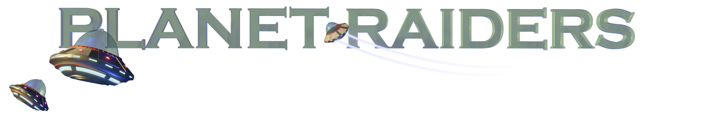

# Final Project for Interactive Graphics 2020/2021

Authors: Alessio Parmeggiani, Alessio Sfregola

Welcome to the Github page of our Interactive Graphics project: Planet Raiders.

The goal of the game is to destroy all the enemy UFOs that are invading the planet.

## How to play

1. W,A,S,D to move around the planet
2. E or SPACE to shoot
3. Drag with the mouse to look around and scrool the mouse wheel to zoom

Link for playing the game: https://sapienzainteractivegraphicscourse.github.io/final-project-planetraiders-team/
Report: https://github.com/SapienzaInteractiveGraphicsCourse/final-project-planetraiders-team/blob/main/report.pdf
